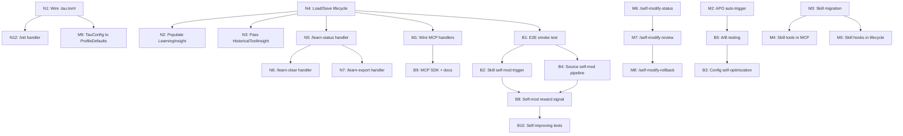

# feat: Wiring, Integration & Self-Improvement Endgame

## Overview

PR #3622 delivered the scaffolding for all 7 radical simplification features. This follow-up plan closes every gap between "types and stubs exist" and "the system actually works end-to-end." It is organized into near-term (wire what exists), medium-term (build missing connective tissue), and bold (close the self-improvement loop).

(see origin: 2026-03-24-001-feat-radical-simplification-self-improvement-plan.md)

## Problem Statement / Motivation

The 7 features from PR #3622 created:
- Types, structs, and traits that aren't yet called from production paths
- MCP tool stubs returning `not_yet_implemented`
- Command catalog entries without handler implementations
- Config parser without startup integration
- Safety evaluation without runtime invocation
- Learning insights without data population

Each gap represents a feature that _looks_ complete in the code but doesn't _work_ in production. This plan closes every gap systematically.

---

## Near-Term: Wire Existing Infrastructure (12 items)

These require minimal new code — they connect existing implementations to existing call sites.

### N1. Wire `.tau.toml` into Startup Dispatch

**What:** `config_file.rs` parser exists but `startup_dispatch.rs` doesn't call it.
**Where:** `crates/tau-onboarding/src/startup_dispatch.rs`
**How:** At the top of startup dispatch, check for `.tau.toml` in project root. If found, call `load_tau_config()`, convert to `ProfileDefaults` via a new `TauConfig::to_profile_defaults()` method, and use as base config. Fall through to wizard/env-var path if not found.
**Acceptance:** `tau init --auto && tau` starts a working session with zero env vars.

### N2. Populate LearningInsight from Real ActionHistoryStore

**What:** `LearningInsight` struct exists in cortex_runtime.rs but is never populated with real data.
**Where:** `crates/tau-agent-core/src/cortex_runtime.rs`, session startup path
**How:** At session start (after `ActionHistoryStore::load()`), construct `LearningInsight` from `failure_patterns()` and `tool_success_rates()`. Pass to `Cortex::refresh_once_with_insights()`.
**Acceptance:** After 10+ sessions with tool failures, `tau learn status` shows patterns AND the Cortex bulletin mentions them.

### N3. Pass HistoricalToolInsight to Recovery Call Sites

**What:** `select_recovery_strategy_with_history()` exists but callers still use the old `select_recovery_strategy()`.
**Where:** `crates/tau-agent-core/src/runtime_turn_loop.rs` (or wherever recovery is triggered)
**How:** At recovery trigger points, query `ActionHistoryStore` for the failing tool's stats, construct `HistoricalToolInsight`, pass to the new function.
**Acceptance:** After a tool fails 3+ times across sessions, recovery uses `AlternativeApproach` instead of blind retry.

### N4. Wire ActionHistoryStore Load/Save to Session Lifecycle

**What:** `load()` and `save()` methods exist but aren't called from session start/end.
**Where:** Session startup and `AgentEvent::AgentEnd` handler
**How:** Call `ActionHistoryStore::load()` during session init (after config resolves the store path). Call `ActionHistoryStore::save()` in the `AgentEvent::AgentEnd` handler.
**Acceptance:** Records persist across `tau` invocations. `ls .tau/action_history.jsonl` shows data after first session.

### N5. Implement `/learn-status` Command Handler

**What:** Command spec registered but no execution handler.
**Where:** `crates/tau-ops/src/` (new file or existing command dispatch)
**How:** Query `ActionHistoryStore` for total records, `failure_patterns(50)`, `tool_success_rates(50)`. Format as readable table. Support `--json` flag.
**Acceptance:** `/learn-status` in TUI shows real data.

### N6. Implement `/learn-clear` Command Handler

**What:** Command spec registered but no execution handler.
**Where:** Same as N5
**How:** Confirm with user, then truncate the JSONL file and reset in-memory store.
**Acceptance:** `/learn-clear --confirm` empties the store; next `/learn-status` shows zero records.

### N7. Implement `/learn-export` Command Handler

**What:** Command spec registered but no execution handler.
**Where:** Same as N5
**How:** Serialize all `ActionRecord` entries to pretty JSON, write to specified path (default: `.tau/learn-export.json`).
**Acceptance:** File contains valid JSON array of ActionRecords.

### N8. Implement `/training-status` Command Handler

**What:** Command spec registered but no execution handler.
**Where:** `crates/tau-ops/src/` or `crates/tau-coding-agent/src/`
**How:** Query `TrainingStore` for rollout count, last reward score, APO run count. Check `LiveRlRuntimeConfig` for threshold progress.
**Acceptance:** `/training-status` shows "12/20 rollouts toward next APO trigger" or similar.

### N9. Implement `/training-trigger` Command Handler

**What:** Command spec registered but no execution handler.
**Where:** Same as N8
**How:** Manually invoke the APO trigger logic from `LiveRlBridge`. Requires access to the training store and current system prompt.
**Acceptance:** `/training-trigger` starts an APO optimization run and reports results.

### N10. Implement `/config-validate` Command Handler

**What:** Command spec registered but no execution handler.
**Where:** `crates/tau-onboarding/src/` or command dispatch
**How:** Call `load_tau_config()` on `.tau.toml`, report success or parse errors.
**Acceptance:** Valid config reports "OK"; invalid config shows specific error with line number.

### N11. Implement `/config-show` Command Handler

**What:** Command spec registered but no execution handler.
**Where:** Same as N10
**How:** Load `.tau.toml`, merge with env vars and CLI flags, render the fully resolved config as TOML.
**Acceptance:** Shows merged config with source annotations (e.g., `model = "claude-sonnet-4-6"  # from .tau.toml`).

### N12. Implement `/init` Command Handler

**What:** Command spec registered but no execution handler.
**Where:** `crates/tau-onboarding/src/`
**How:** `tau init` → interactive wizard asking model, auth method, channels. `tau init --auto` → call `generate_default_config()`, write to `.tau.toml`. `tau init --from-env` → read current env vars, generate matching config.
**Acceptance:** `tau init --auto` creates a valid `.tau.toml` in < 2 seconds.

---

## Medium-Term: Build Connective Tissue (15 items)

These require meaningful new code — connecting subsystems, implementing real MCP handlers, and building the extension migration path.

### M1. Wire 20 MCP Stub Handlers to Real Runtimes

**What:** 20 MCP tools return `not_yet_implemented`. Each needs a real handler.
**Where:** `crates/tau-tools/src/mcp_server_runtime.rs`
**Priority order:**
1. `tau.session_list` / `tau.session_search` / `tau.session_stats` → delegate to `SessionRuntime`
2. `tau.learn_status` / `tau.learn_failure_patterns` / `tau.learn_tool_rates` → delegate to `ActionHistoryStore`
3. `tau.training_status` / `tau.training_trigger` → delegate to `TrainingStore` / `LiveRlBridge`
4. `tau.skills_list` / `tau.skills_search` / `tau.skills_info` → delegate to skill catalog
5. `tau.agent_spawn` / `tau.agent_status` / `tau.agent_cancel` → delegate to orchestrator
6. `tau.session_resume` / `tau.session_export` → delegate to `SessionRuntime`
7. `tau.skills_install` → delegate to skill install pipeline
8. `tau.context.learning` / `tau.context.training` / `tau.context.config` → compose context strings
**Acceptance:** `mcp tools/call tau.learn_status` returns real data, not stub.

### M2. Implement APO Auto-Trigger Background Job

**What:** LiveRlBridge logs when threshold is reached but doesn't spawn APO.
**Where:** `crates/tau-coding-agent/src/live_rl_runtime.rs`
**How:** When rollout count hits threshold, spawn `ApoAlgorithm::run()` as a background task via `BackgroundJobRuntime`. Use recent rollouts as training examples (top/bottom reward quartiles). Persist improved prompt via `TrainingStore::update_resources()`.
**Acceptance:** After 20 sessions, APO runs automatically and `tau training status` shows the new prompt version.

### M3. Create Skill Equivalents for Built-in Extensions

**What:** Extensions are deprecated but no skill equivalents exist yet.
**Where:** `skills/` directory
**How:** For each extension manifest in the codebase, create an equivalent skill package with the same tools/hooks/commands declared in the new skill manifest format. Test that the skill-based version produces identical behavior.
**Acceptance:** Every extension has a skill equivalent. `tau skills list` shows them.

### M4. Wire Skill Runtime Tool Dispatch into MCP Server

**What:** `dispatch_skill_tool()` exists but isn't called from the MCP server tool dispatch path.
**Where:** `crates/tau-tools/src/mcp_server_runtime.rs`
**How:** After checking built-in tools and before external tools, check if the tool name matches a skill-registered tool. If so, delegate to `dispatch_skill_tool()`.
**Acceptance:** A skill with a tool definition is callable via MCP.

### M5. Wire Skill Runtime Hook Dispatch into Agent Lifecycle

**What:** `dispatch_skill_hook()` exists but isn't called from agent lifecycle events.
**Where:** Agent event handler (where `AgentEvent` variants are processed)
**How:** On `AgentEvent::AgentStart`, dispatch `SkillHook::RunStart` for all loaded skills. On `AgentEvent::AgentEnd`, dispatch `SkillHook::RunEnd`. On tool events, dispatch Pre/PostToolCall hooks.
**Acceptance:** A skill with hooks receives lifecycle events.

### M6. Implement `/self-modify-status` Command Handler

**What:** Command spec registered but no execution handler.
**Where:** `crates/tau-coding-agent/src/self_modification_runtime.rs`
**How:** Track self-modification proposals in a local store (JSONL or SQLite). `/self-modify-status` lists recent proposals with: id, target, applied/rejected, timestamp, rationale.
**Acceptance:** Shows "No self-modifications proposed yet" initially; shows history after proposals.

### M7. Implement `/self-modify-review` Command Handler

**What:** Command spec registered but no execution handler.
**Where:** Same as M6
**How:** Show pending proposals with diff preview. Allow approve/reject via TUI prompt.
**Acceptance:** Operator can review and approve/reject a pending self-modification.

### M8. Implement `/self-modify-rollback` Command Handler

**What:** Command spec registered but no execution handler.
**Where:** Same as M6
**How:** Given a proposal ID, revert the change (git revert for source, file restore for skills/config).
**Acceptance:** Rolled-back change is undone; `/self-modify-status` shows rollback record.

### M9. Implement `TauConfig::to_profile_defaults()` Conversion

**What:** `.tau.toml` parses to `TauConfig` but there's no conversion to `ProfileDefaults`.
**Where:** `crates/tau-onboarding/src/config_file.rs`
**How:** Map each `TauConfig` section to the corresponding `ProfileDefaults` fields. Handle missing/default values gracefully.
**Acceptance:** Unit test: `TauConfig::default().to_profile_defaults()` matches `ProfileDefaults::default()` on all shared fields.

### M10. Migrate Remaining 126 Active Scripts to `tau ops`

**What:** 98 scripts archived, 126 remain. Most are verification gates and dev helpers.
**Where:** `scripts/verify/`, `scripts/dev/`, `scripts/run/`
**How:** For each remaining script: translate to Rust function, add to verification_gates.rs or new dev_ops.rs, register in command catalog. Parallel archival of the bash originals.
**Acceptance:** `scripts/` contains only `archive/`, `run/tau-unified.sh`, and a README. Everything else is in `tau ops`.

### M11. Add CI Gate Blocking New Unregistered Scripts

**What:** No enforcement preventing new scripts from accumulating.
**Where:** `.github/workflows/` or `tau ops validate`
**How:** CI check: scan `scripts/` (excluding `scripts/archive/`) for `.sh` files not referenced by the command catalog. Fail if any found.
**Acceptance:** PR adding a new script to `scripts/dev/` without registering it in command catalog fails CI.

### M12. Implement `tau ops verify all` Runner

**What:** `run_all_gates()` exists in Rust but has no CLI entry point.
**Where:** CLI argument parsing (clap) or TUI command dispatch
**How:** Wire the `/ops-verify` command to call `run_all_gates()`, render report with `render_gate_report()`, support `--json` flag.
**Acceptance:** `tau ops verify all` runs all gates and prints pass/fail. `tau ops verify all --json` outputs machine-readable report.

### M13. Implement `tau ops validate` (fast-validate replacement)

**What:** Command spec registered; needs Rust implementation of impacted-package detection.
**Where:** `crates/tau-ops/src/`
**How:** Use `cargo metadata --format-version=1` to get dependency graph. Given git diff, determine impacted packages. Run `cargo test -p <pkg>` for each.
**Acceptance:** `tau ops validate` runs tests only for packages affected by current changes.

### M14. Add Tab Completion Generation

**What:** No shell completions for `tau ops` commands.
**Where:** CLI entry point
**How:** Use clap's `generate` feature to produce zsh/bash/fish completions. `tau ops completions zsh > _tau`.
**Acceptance:** Tab completion works for `tau ops <tab>` in zsh.

### M15. Implement `/ops-dev` Subcommand Group

**What:** Command spec registered but no dev workflow shortcuts exist.
**Where:** `crates/tau-ops/src/`
**How:** Common dev tasks: `tau ops dev test` (run tests for current changes), `tau ops dev lint` (cargo fmt + clippy), `tau ops dev bench` (run benchmarks), `tau ops dev clean` (clean build artifacts).
**Acceptance:** `tau ops dev test` runs impacted tests; `tau ops dev lint` runs fmt+clippy.

---

## Bold: Close the Self-Improvement Loop (10 items)

These build the endgame — Tau that gets measurably better with every session.

### B1. End-to-End Self-Improvement Smoke Test

**What:** Validate the full loop: session → action history → learning → training → APO → better prompt.
**Where:** Integration test or manual test protocol
**How:** Run 25 scripted sessions with deliberate tool failure patterns. Verify: (1) action history records all failures, (2) failure patterns surface in Cortex bulletin, (3) recovery strategies adapt, (4) rollouts accumulate with reward scores, (5) APO triggers and produces a new prompt, (6) next session uses the improved prompt.
**Acceptance:** Documented test protocol with pass/fail checklist. At least one APO optimization cycle completes successfully.

### B2. Implement Skill Self-Modification Trigger

**What:** The self-modification pipeline exists but nothing triggers it automatically.
**Where:** `crates/tau-coding-agent/src/self_modification_runtime.rs`
**How:** After each session, check `ToolEffectiveness` for skills with success rate declining over last 10 sessions. If a skill's effectiveness drops below 40%, generate a `SelfModificationProposal` with the skill file as target. Use the coding agent to propose an improvement to the skill's prompt content.
**Acceptance:** After 20 sessions where a skill underperforms, a proposal appears in `/self-modify-review`.

### B3. Implement Config Self-Optimization

**What:** `.tau.toml` exists but never self-tunes.
**Where:** Self-modification runtime
**How:** After APO produces an improved prompt, check if any config values should change (e.g., `max_records` too low, `retention_days` too short based on data volume). Generate a config modification proposal.
**Acceptance:** Config change proposals appear with data-driven rationale.

### B4. Implement Source Code Self-Modification (Worktree Pipeline)

**What:** `create_self_mod_worktree()` exists but the full pipeline isn't wired.
**Where:** `crates/tau-coding-agent/src/self_modification_runtime.rs`
**How:** When a recurring failure pattern has a clear fix hypothesis:
1. Create worktree via `git worktree add`
2. Point the coding agent at the worktree with the fix hypothesis
3. Run `cargo test` in the worktree
4. If tests pass, run `evaluate_self_modification()` safety check
5. If safety clears, create a draft PR via `gh pr create --draft`
6. Notify operator
**Acceptance:** A draft PR appears on GitHub with a test-passing fix proposed by Tau.

### B5. Implement A/B Testing for APO-Optimized Prompts

**What:** APO produces new prompts but there's no safe way to validate them in production.
**Where:** LiveRlBridge or session startup
**How:** After APO produces a candidate prompt, route 10% of sessions to the new prompt (via a session-level flag). Compare reward scores between control and experiment. If experiment scores higher after 20+ sessions, promote it. If lower, discard.
**Acceptance:** `tau training status` shows A/B test status: "Experiment prompt: 12/20 sessions, avg reward 0.72 vs control 0.61".

### B6. Cross-Channel Learning Unification

**What:** Each channel (Slack, Discord, GitHub Issues, CLI) learns independently.
**Where:** `crates/tau-memory/src/action_history.rs`
**How:** Add `channel: String` field to `ActionRecord`. Aggregate failure patterns and tool success rates across all channels. A tool that fails in Slack gets deprioritized everywhere.
**Acceptance:** `/learn-status` shows cross-channel aggregated data. Failure in one channel affects routing in others.

### B7. Episodic Causal Memory (Beyond Flat History)

**What:** Action history records individual events but no causal chains.
**Where:** `crates/tau-memory/src/action_history.rs`
**How:** Add `caused_by: Option<String>` and `led_to: Option<String>` fields to `ActionRecord`. When a recovery strategy is selected because of a failure, link them. When Cortex retrieves patterns, traverse causal chains to provide "I tried X, it failed because Y, then Z worked" episodes.
**Acceptance:** Cortex bulletin includes causal narratives, not just statistics.

### B8. Self-Modification Reward Signal

**What:** Self-modifications are tracked but not scored.
**Where:** Self-modification runtime + training pipeline
**How:** After a self-modification is applied, track the modified artifact's effectiveness over the next 10 sessions. Compute a reward signal: did the modification improve the target metric? Feed this back into the training store as a rollout.
**Acceptance:** Self-modifications that improve effectiveness get positive reward; degradations get negative reward and trigger rollback.

### B9. Publish Tau as MCP Infrastructure (SDK + Docs)

**What:** MCP server has 33+ tools but no documentation or client SDK.
**Where:** New `docs/mcp-api/` directory, optional `tau-sdk` crate
**How:** Auto-generate MCP tool documentation from the tool schemas. Publish a `tau-sdk` crate that wraps MCP client calls with typed Rust functions. Add examples showing how Claude Desktop or Cursor can use Tau as a tool provider.
**Acceptance:** External MCP client can discover and call all 33+ Tau tools with type-safe SDK.

### B10. Self-Improving Test Suite

**What:** Tests are static — they don't evolve with learned patterns.
**Where:** Test generation pipeline
**How:** After each self-modification, if the modification added a new failure pattern or recovery strategy, automatically generate a regression test that reproduces the original failure and verifies the fix. Add to the test suite via the self-modification pipeline.
**Acceptance:** The test count increases automatically as Tau learns new patterns. Each self-modification produces at least one new test.

---

## Dependencies

## Acceptance Criteria

### Near-Term (N1-N12)
- [ ] `.tau.toml` drives startup config
- [ ] Action history loads/saves to disk every session
- [ ] Learning insights appear in Cortex bulletin with real data
- [ ] Recovery uses historical tool failure data
- [ ] All 12 command handlers produce real output (not stubs)

### Medium-Term (M1-M15)
- [ ] All 20 MCP stub handlers return real data
- [ ] APO runs automatically after threshold rollouts
- [ ] Every extension has a skill equivalent
- [ ] Skill tools and hooks are callable from MCP and lifecycle events
- [ ] Self-modification commands work end-to-end
- [ ] `tau ops verify all` and `tau ops validate` replace shell scripts
- [ ] CI blocks unregistered new scripts
- [ ] Tab completion works in zsh/bash

### Bold (B1-B10)
- [ ] Full self-improvement loop demonstrated end-to-end
- [ ] Skills self-modify based on effectiveness data
- [ ] Source code PRs generated automatically from failure patterns
- [ ] A/B testing validates prompt improvements safely
- [ ] Cross-channel learning aggregates experience
- [ ] Self-modifications produce reward signals and regression tests
- [ ] External clients use Tau as MCP infrastructure via SDK

## Success Metrics

| Metric | Baseline | Target |
|--------|----------|--------|
| Commands returning real data | 0/15 | 15/15 (near-term) |
| MCP tools functional | 13/33 | 33/33 (medium-term) |
| Shell scripts remaining | 126 | 0 (medium-term) |
| APO cycles completed | 0 | 5+ (bold) |
| Self-modifications proposed | 0 | 10+ (bold) |
| Self-modifications improving effectiveness | N/A | >60% (bold) |

## Risk Analysis

| Risk | Mitigation |
|------|-----------|
| APO produces worse prompts | B5 (A/B testing) validates before promoting |
| Self-modification breaks tests | Safety pipeline + test gate + operator approval |
| ActionHistoryStore grows unbounded | Retention pruning (30 days) + max records (1000) |
| Extension→Skill migration loses capability | Gap analysis table from PR #3622 as acceptance gate |
| MCP handler wiring introduces regressions | Each handler gets integration test before removing stub |

## Sources & References

### Origin
- **Origin document:** [2026-03-24-001-feat-radical-simplification-self-improvement-plan.md](2026-03-24-001-feat-radical-simplification-self-improvement-plan.md) — 7-feature implementation plan; this follow-up closes all gaps between scaffolding and production.

### Internal References
- PR #3622: Radical Simplification & Self-Improvement scaffolding
- Action history: `crates/tau-memory/src/action_history.rs`
- Recovery: `crates/tau-agent-core/src/recovery.rs`
- Cortex: `crates/tau-agent-core/src/cortex_runtime.rs`
- Config parser: `crates/tau-onboarding/src/config_file.rs`
- MCP server: `crates/tau-tools/src/mcp_server_runtime.rs`
- Self-mod runtime: `crates/tau-coding-agent/src/self_modification_runtime.rs`
- Safety: `crates/tau-safety/src/lib.rs`
- Skill runtime: `crates/tau-skills/src/skill_runtime.rs`
- Verification gates: `crates/tau-ops/src/verification_gates.rs`
- Command catalog: `crates/tau-ops/src/command_catalog.rs`
- LiveRlBridge: `crates/tau-coding-agent/src/live_rl_runtime.rs`
- APO: `crates/tau-algorithm/src/apo.rs`
- Reward inference: `crates/tau-algorithm/src/reward_inference.rs`

### Related Plans
- Autonomous operator mission control: `docs/ideation/2026-03-23-autonomous-operator-mission-control-ideation.md`
- Prior plans: `docs/plans/2026-03-23-001` through `006`
